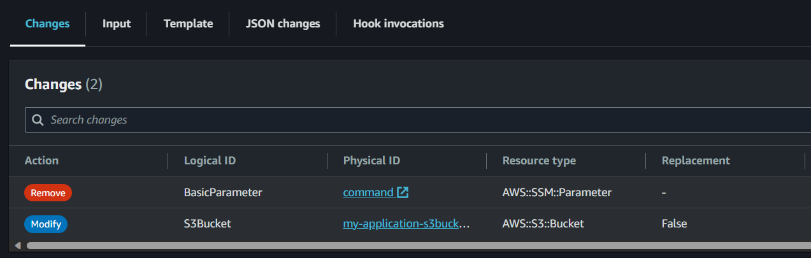
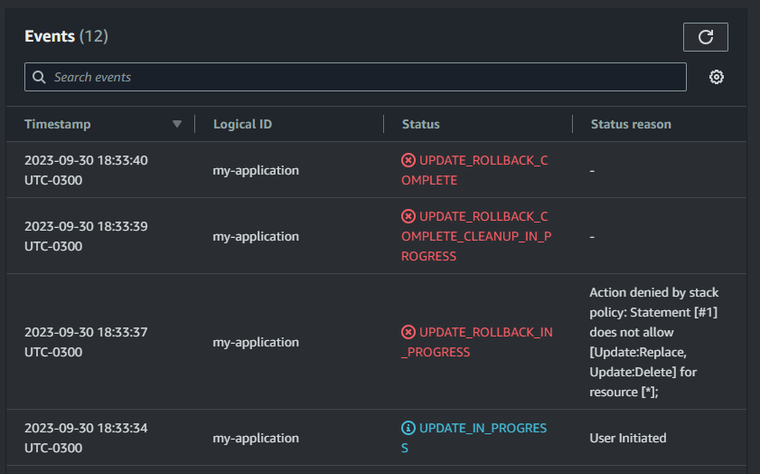
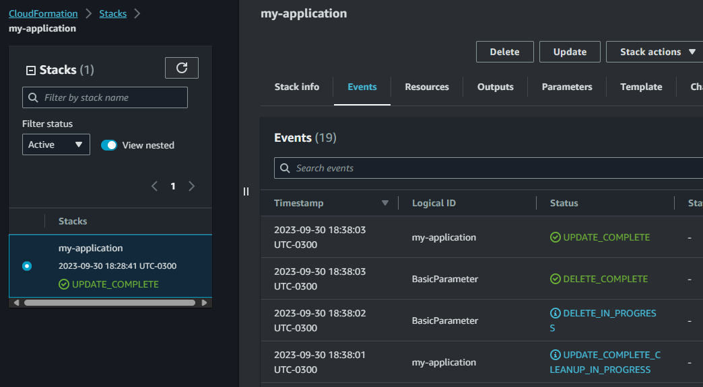

# AWS CloudFormation protection

CloudFormation templates to test security features to protect stack resources.

This exercise will test two scenarios:

1. **Delete protection**: Prevent the stack from being accidentally being setting `--enable-termination-protection`.
2. **Stack policy**: Setting a stack policy to prevent updates to the stack by restricting `Update:Delete` and `Update:Replace` actions.

Further information in the documentation on how to [protect stack resources][1].

## Setup

Create the **stack**:

> Stack created with `--enable-termination-protection` to protect against accidental deletes

```sh
aws cloudformation create-stack \
  --stack-name my-application \
  --template-body file://template-create.json \
  --enable-termination-protection \
  --parameters ParameterKey=EnvironmentTag,ParameterValue=production
```

A new S3 bucket and SSM parameter will be created.

Now set the stack policy:

```sh
aws cloudformation set-stack-policy \
    --stack-name my-application \
    --stack-policy-body file://stack-policy-deny.json
```

## Delete resources from the stack

Let's see if the stack policy works.

Create a **change set**:

```sh
aws cloudformation create-change-set \
    --stack-name my-application \
    --change-set-name removed-ssm \
    --template-body file://template-update.json
```

Verify the changes:



Execute the change set:

```sh
aws cloudformation execute-change-set \
    --change-set-name removed-ssm \
    --stack-name my-application
```

The stack policy will block it, as expected:




Now apply an this "allow all" policy and re-try the change set commands afterwards:

```sh
aws cloudformation set-stack-policy \
    --stack-name my-application \
    --stack-policy-body file://stack-policy-allow.json
```

This time it will work:



## Delete protection

Trying to delete the Stack is not possible.

```sh
aws cloudformation delete-stack --stack-name my-application
```

It is necessary to remove the delete protection:

```sh
aws cloudformation update-termination-protection --stack-name my-application --no-enable-termination-protection
```

[1]: https://docs.aws.amazon.com/AWSCloudFormation/latest/UserGuide/protect-stack-resources.html
